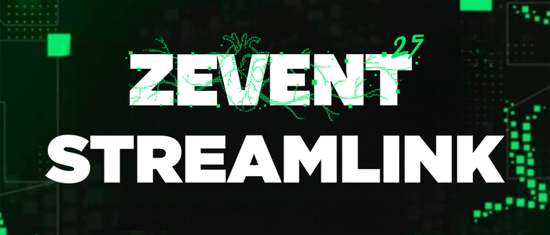

<div align="center">
  
</div>

<p align="center">
  <a href="https://zevent.fr/don" target="_blank">🧡 Faire un don au ZEvent</a>
</p>

---

## 📖 Description

ZEvent-Streamlink est une application web complète pour gérer et streamer les flux Twitch des participants au ZEvent directement dans OBS Studio. L'application permet de suivre l'état des streams en temps réel, et d'intégrer automatiquement les flux dans OBS via Websocket (fonctionne également avec des streamers n'étant pas dans la liste du ZEvent mais plus limité).

(C'est un projet expérimental, nouveau et sera amené à être amélioré pour la prochaine édition.)

---

## ✨ Fonctionnalités

### 🎥 Gestion des Streams
- **Interface web moderne** : Interface Vue.js responsive pour gérer tous vos streams
- **État en temps réel** : Suivi automatique de l'état live/offline des streamers via l'api de Twitch

### 🎮 Intégration OBS Studio
- **WebSocket OBS** : Connexion automatique à OBS Studio via WebSocket v5.x
- **Décodage matériel** : Support GPU/CPU avec toggle par stream
- **Gestion des scènes** : Création automatique des sources dans OBS
- **Chat Twitch** : Affichage optionnel du chat pour chaque stream ()

### 📊 Statistiques ZEvent
- **API ZEvent** : Récupération des données via l'api officiel
- **Statistiques temps réel** : Suivi des dons, participants, et stats

---

## 🚀 Installation

### Prérequis
- **Node.js**
- **npm**
- **OBS Studio** avec WebSocket activé
- **Git**

### 1. Cloner le projet
```bash
git clone https://github.com/fabienmillet/zevent-streamlink.git
cd zevent-streamlink
```

### 2. Installation des dépendances

#### Backend
```bash
cd backend
npm install
```

#### Frontend
```bash
cd frontend
npm install
```

### 3. Configuration

#### Backend (.env)
Copier le fichier de configuration :
```bash
cd backend
cp .env.example .env
```

Éditer `.env` avec vos paramètres 


#### Configuration OBS Studio
1. Ouvrir OBS Studio
2. Aller dans **Outils** → **Paramètres du serveur WebSocket**
3. Activer le serveur WebSocket (port 4455)
4. Définir un mot de passe et l'ajouter dans `.env`

---

## 🏃‍♂️ Démarrage

### Démarrage rapide
```bash
# Backend
cd backend
npm start

# Frontend  
cd frontend
npm run dev
```

Puis ouvrir : http://localhost:5173

### URLs importantes
- **Interface web** : http://localhost:5173
- **API backend** : http://localhost:3001  
- **Health check** : http://localhost:3001/health
- **Documentation API** http://localhost:3001/docs

---

## 🤝 Contribution

Des améliorations ? Des bugs ? N'hésitez pas à :
- Ouvrir une **issue** pour signaler un problème
- Proposer une **pull request** avec vos modifications

---

## 📄 Licence

Ce projet est sous licence MIT. Voir le fichier `LICENSE` pour plus de détails.
